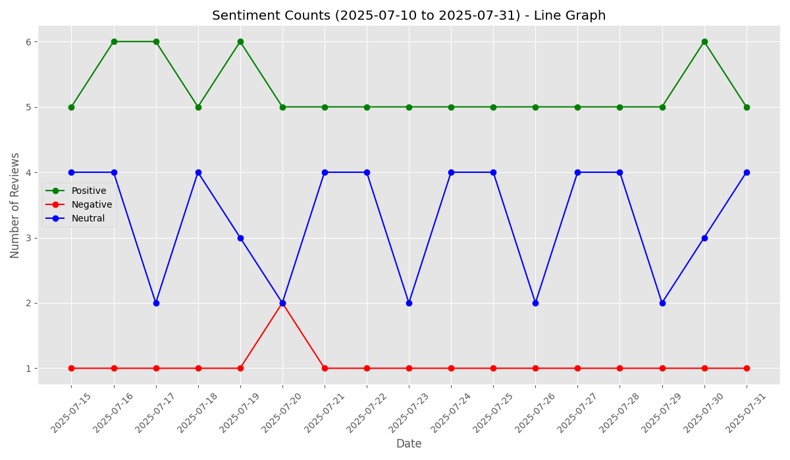

# Sentiment Visualization and Reply Management Project - SteamNoodles

## Author
- **Name**: Yasith Madushan Hewarathna
- **University**: University of Moratuwa
- **Year**: Second year

## Summary of Approach
This project focuses on analyzing restaurant reviews and managing replies using two main components: a `Customer_Feedback_Response_Agent` and a`Sentiment_Visualization_Agent` (or data processing agent). The approach involves:

1. **Data Collection and Storage**:
   - Reviews are stored in a `review` table with `id`, `date`, and `review_text`.
   - Replies are linked via a `reply` table with `review_ID`, `review_text`, `sentiment`, `reply`, and `date`.
   - All test data in the database are AI-generated, covering 2025-07-15 to 2025-08-15.
   - This structure optimizes the `Sentiment_Visualization_Agent` by reusing pre-classified sentiments, saving time, resources, and costs.

2. **Customer Feedback Response Agent**:
   - Processes unmatched reviews (without replies) using a SQL `LEFT JOIN` query.
   - Classifies sentiment and generates context-aware replies, storing them in the `reply` table.
   - **Workflow Visualization**:

     

3. **Sentiment Visualization Agent**:
   - Generates bar or line graphs based on a specified date range and chart type, saving plots in the `graphs` folder.
   - **Workflow Visualization**:
   
     

The project uses SQLite for database management and Python for agent implementation, with regex (`re.split`) for CSV parsing and SQL for data querying.

## Instructions to Test Both Agents

### Prerequisites
- Python 3.x installed
- SQLite3 (included with Python)
- Required libraries: `sqlite3`, `langgraph`, `matplotlib`, `typing_extensions`, `python-dotenv`

Run:
```shell
pip install -r requirements.txt
```

### Setup
1. **Clone the Repository**:
   ```bash
   git clone https://github.com/yasith8314/SteamNoodles-agent.git
   cd SteamNoodles-agent
   ```
   
2. **Create a `.env` in there and store the Groq AIP key there.
    ```bash
    GROQ_API_KEY=YOUR_API_KEY
    ```

3. **Run main.py to run all tests**:
    ```bash
    python main.py
    ```

### Sample Outputs

1. Output One:

    

2. Output Two

    